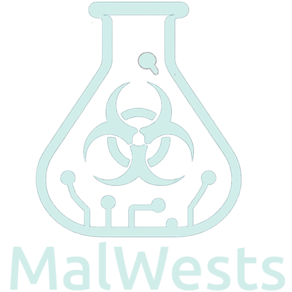

---

**Malware + Tests** – My Malware Development and Testing Repository  

Welcome to **MalWests**, a repository dedicated to exploring malware development for **Ethical Hacking, educational and research purposes only**.  
Each folder in this repo contains:  
- **malware code sample**   
- A **README** describing the malware's behavior, techniques, and purpose.  
- **Malware scanner results** for analysis and detection insights.  

> ⚠️ **Disclaimer:**  
> All samples are for **Ethical Hacking, and educational purposes** and should only be run in **isolated, controlled environments** like sandboxes or virtual machines.  
> I do **not** encourage or condone malicious use.  

---

## 🧪 Goals  
- Learn malware development techniques safely.  
- Understand detection methods via AV scanners.  
- Document behaviors, signatures, and mitigation strategies.  
- Security Test only on authorized devices and in secure environments.

---

## 🚀 How to Use  

1. Clone the repository:  
   ```bash
   git clone https://github.com/yourusername/MalWests.git
   cd MalWests
   ```

2. Open individual sample folders to review code, documentation, and results.  

3. **Do not run these files on your host system.** Use a sandboxed environment like:  
   - [Any.Run](https://any.run/)  
   - [Cuckoo Sandbox](https://cuckoosandbox.org/)  
   - Virtual machines (e.g., VirtualBox, VMware).  

---

## 📜 License  
This repository is for **Ethical Hacking, educational and research purposes only**. Use responsibly.  
